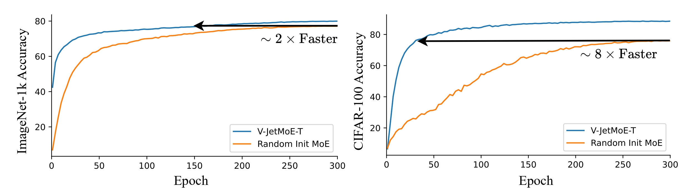
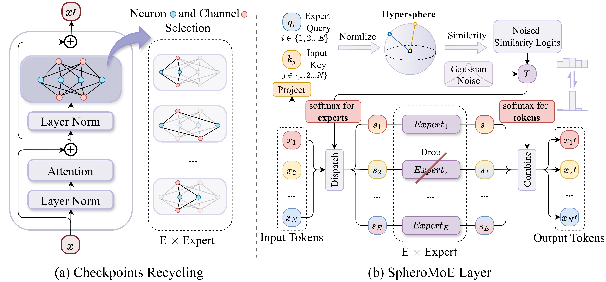

<div align="center">

###  [MoE Jetpack: From Dense Checkpoints to Adaptive Mixture of Experts for Vision Tasks](https://arxiv.org/abs/2406.04801)

[Xingkui Zhu](https://scholar.google.com/citations?user=wKKiNQkAAAAJ&hl=zh-CN) <sup>* </sup>,
Yiran Guan  <sup>* </sup>,
Dingkang Liang </sup>,
Yuchao Chen </sup>,
Yuliang liu </sup>,
[Xiang Bai](https://xbai.vlrlab.net) <sup>✉</sup>
<br>
Huazhong University of Science and Technology,
<br>
\* Equal contribution, ✉ Corresponding author.
<br>


[**NeurIPS 2024**](https://neurips.cc/virtual/2024/poster/95262) | [**arXiv**](https://arxiv.org/abs/2406.04801)
<h5 align="center"> If you like our project, please give us a star ⭐ on GitHub for the latest update.</h5>

</div>

## 📣 News
* **2024.09.26**: MoE Jetpack has been accepted by NeurIPS 2024. 🎉
* **2024.06.7**: MoE Jetpack paper released. 🔥

## ⭐️ Highlights
* 🔥 **Strong performance**. MoE Jetpack boosts accuracy across multiple vision tasks, outperforming both dense and Soft MoE models.
<div align=center>

</div>

* ⚡ **Fast Convergence**. Leveraging checkpoint recycling, MoE Jetpack speeds up convergence, achieving target accuracies significantly faster than training from scratch.
<div align=center>

</div>


* 🤝 **Strong generalization**. MoE Jetpack achieve significant performance improvements on both Transformer and CNN on 8 downstream vision datasets.

* 😮 **Running Efficiency**.  We provide an efficient implementation of the expert's parallelisation, whereby the FLOPs and training wall time remain nearly identical to those of a dense model.

## ⚡ Overview

We present MoE Jetpack, a framework that fine-tunes pre-trained dense models into Mixture of Experts with checkpoint recycling and SpheroMoE layers, improving convergence speed, accuracy, and computational efficiency in several down stream visual tasks.

<div align=center>

</div>


## 📦 Download URL

| File Type                           | Description                                                                | Download Link (Google Drive)                                      |
|-------------------------------------|----------------------------------------------------------------------------|-------------------------------------------------------------------|
| **Checkpoint Recycling**            |    **Sampling from Dense Checkpoints to Initialize MoE  Weights**                            |                                                                   |
| Dense Checkpoint (ViT-T)            | Pre-trained ViT-T weights on ImageNet-21k for checkpoint recycling          | 🤗 [ViT-T Weights](https://drive.google.com/file/d/1AIFPxqlXfCTXvTzA4R6BIujvloMURzRZ/view?usp=sharing)                  |
| Dense Checkpoint (ViT-S)            | Pre-trained ViT-S weights on ImageNet-21k for checkpoint recycling          | 🤗 [ViT-S Weights](https://drive.google.com/file/d/1-E4XgHxVb1XsE4_YKzCHQlKlowcmANLX/view?usp=sharing)                  |
| MoE Jetpck Init Weights                    |  Initialized weight using checkpoint recycling (ViT-T/ViT-S)      | [MoE Init Weights](https://drive.google.com/file/d/156E_8hgU1JtSON6TLb69iCQK5nF7clmE/view?usp=sharing)               |
| **MoE Jetpack** |      **Fine-tuning initilized SpheroMoE on ImageNet-1k**   |                 |
| Config          | Config file for fine-tuning SpheroMoE model using checkpoint recycling weights | [MoE Jetpack Config](https://drive.google.com/file/d/1gHsMDicJCPq_dV2RATIpH59jCxtsOdnd/view?usp=sharing)  |
| Fine-tuning Logs                          | Logs from fine-tuning SpheroMoE                                           | [MoE Jetpack Logs](https://drive.google.com/file/d/1_9VLw8C2AgfIW5xeaVcJgk8efhhWnCEo/view?usp=sharing)               |
| MoE Jetpack Weights                 | Final weights after fine-tuning on ImageNet-1K       | [MoE Jetpack Weights](https://drive.google.com/file/d/1em88nNFf6vVNA4ert4URlSQMaTwMxPKY/view?usp=sharing)            |


## 📊 Main Results
### Comparisons between MoE Jetpack, Densely activated ViT, and Soft MoE
<div align=center>

</div>


<!-- ## 😍 Why is MoE Jetpack better?
 -->


## 🚀 Getting Started
<!-- 快速测试 和 训练的脚本 -->
### 🔧 Installation
Follow these steps to set up the environment for **MoE Jetpack**:

#### 1. Install [PyTorch v2.1.0](https://pytorch.org/get-started/previous-versions/#v210:~:text=org/whl/cpu-,v2.1.0,-Conda) with CUDA 12.1
```bash
pip install torch==2.1.0 torchvision==0.16.0 torchaudio==2.1.0 --index-url https://download.pytorch.org/whl/cu121
```

#### 2. Install [MMCV 2.1.0](https://mmcv.readthedocs.io/en/latest/get_started/installation.html#install-mmcv:~:text=Select%20the%20appropriate%20installation%20command%20depending%20on%20the%20type%20of%20system%2C%20CUDA%20version%2C%20PyTorch%20version%2C%20and%20MMCV%20version)
```bash
pip install mmcv==2.1.0 -f https://download.openmmlab.com/mmcv/dist/cu121/torch2.1/index.html
```

#### 3. Install MoE Jetpack 
Clone the repository and install it:
```bash
git clone https://github.com/Adlith/MoE-Jetpack.git
cd path/to/MoE-Jetpack
pip install -U openmim && mim install -e .
```
For more details and prepare datasets, refer to [MMPretrain Installation](https://mmpretrain.readthedocs.io/en/latest/get_started.html#install-from-source)

#### 4. Install Additional Dependencies
```bash
pip install timm einops entmax python-louvain scikit-learn pymetis
```

Now you're ready to run MoE Jetpack!

### 📁 Project Directory Structure

Below is an overview of the **MoE Jetpack** project structure with descriptions of the key components:

```bash
MoE-Jetpack/
│
├── data/
│   ├── imagenet/
│   │   ├── train/
│   │   ├── val/
│   │   └── ...
│   └── ...
│
├── moejet/                         # Main project folder
│   ├── configs/                     # Configuration files
│   │   └── timm/                    # Contains config files for training MoE Jetpack
│   │       ├── vit_tiny_dual_moe_timm_21k_ft.py 
│   │       └── ...                 
│   │
│   ├── models/                      # Contains the model definition files
│   │   └── ...                      
│   │
│   ├── tools/                       # Utility scripts and tools
│   │   └── gen_weight/              # Contains scripts for generating MoE weights from dense models
│   │       └── gen_ViT_MoE_weight.py # Script to convert ViT dense checkpoints into MoE format
│   │
│   ├── weights/                     # Folder for storing pre-trained weights
│   │   └── gen_weight/              # MoE initialization weights go here
│   │       └── ...                  
│   │
│   └── ...                          # Other project-related files and folders
│
├── README.md                        # Project readme and documentation
└── ...                              
```


### 🗝️ Training & Validating
* The training & Testing code is built on [MMPretrain](https://github.com/open-mmlab/mmpretrain). Please refer to [Training Doc](https://mmpretrain.readthedocs.io/en/latest/user_guides/train.html#train) for more details.

```python
# For example, train MoE Jet on Imgnet-1K

CUDA_VISIBLE_DEVICES=0,1,2,3 PORT=29500 ./tools/dist_train.sh moejet/configs/timm/vit_tiny_dual_moe_timm_21k_ft.py 4
```
By default, we use **4 GPUs** with a **batch size of 256 per GPU**. Gradient accumulation simulates a **total batch size of 4096**.

To customize hyperparameters, modify the relevant settings in the [configuration file](moejet/configs/timm/vit_tiny_dual_moe_timm_21k_ft.py#L11-L15).


<!-- ## 📅 TODO
- [x] Release the paper.
- [x] Release the code. -->


## 🖊️ Citation
```
@article{zhu2024moe,
  title={MoE Jetpack: From Dense Checkpoints to Adaptive Mixture of Experts for Vision Tasks},
  author={Xingkui Zhu, Yiran Guan, Dingkang Liang, Yuchao Chen, Yuliang Liu, Xiang Bai},
  journal={Advances in Neural Information Processing Systems},
  year={2024}
  }
```

## 👍 Acknowledgement
We thank these great works and open-source repositories:
[MMPreTrain](https://github.com/open-mmlab/mmpretrain), [Soft MoE](https://github.com/google-research/vmoe/tree/main/vmoe/projects/soft_moe).

